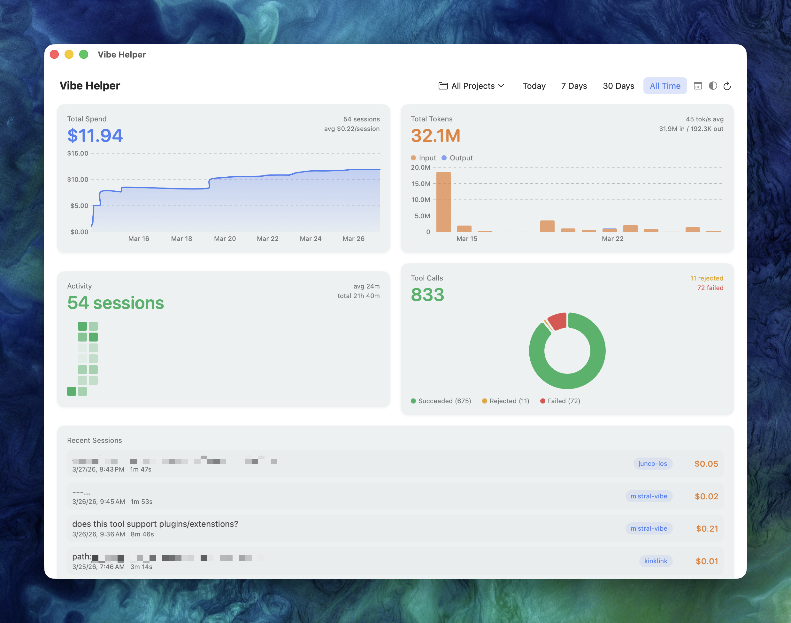

# Vibe Helper

A native macOS dashboard app for visualizing your [Mistral Vibe CLI](https://github.com/mistralai/mistral-vibe) usage — costs, tokens, sessions, and tool call analytics — all in a clean, minimal interface.

  



## Features

### Dashboard & Analytics
- **Cost Tracking** — Cumulative spend over time, average cost per session, cost by project
- **Token Analytics** — Input vs output token breakdown, tokens/sec performance trends
- **Activity Heatmap** — GitHub-style calendar heatmap showing session frequency and duration
- **Tool Usage** — Donut chart of tool call outcomes (succeeded, rejected, failed)
- **Per-Project Filtering** — Filter all stats by project/working directory
- **Time Range Controls** — Quick presets (Today, 7 Days, 30 Days, All Time) + custom date picker
- **Session Detail View** — Click any session to drill into full stats, token breakdown, tool calls, and timing
- **Session Replay** — View the full conversation for any session, including assistant messages and tool calls with expandable arguments
- **Live Updates** — File system watcher auto-refreshes when new sessions complete

### Skill Management
- **Browse & Search Skills** — View all skills with name, description, enabled status, and allowed tools
- **Create Skills** — Add new skills with name, description, allowed tools, and markdown instructions
- **Edit & Delete Skills** — Modify or remove skills with automatic backup before deletion
- **User Invocable Toggle** — Control whether CLI users can invoke skills directly

### Model & Provider Settings
- **Model Configuration** — View and edit model settings: alias, provider, temperature, thinking mode, and pricing
- **Provider Configuration** — Manage API providers: base URL, API key env var, API style, and backend
- **Safe Config Editing** — Automatic timestamped backups before every save, atomic writes, and post-write validation with auto-restore on failure
- **Backup & Restore** — Browse and restore previous config backups from within the app

## Requirements

- macOS 14 (Sonoma) or later
- Mistral Vibe CLI with session logging enabled (default)

## Installation

### Download (recommended)

1. Go to the [Releases](../../releases) page
2. Download the latest `VibeHelper-x.x.x-macOS.dmg`
3. Open the DMG and drag **Vibe Helper** to your Applications folder
4. Launch from Applications

> **Note:** Since the app is not notarized with Apple, macOS will show a warning on first launch.
> Right-click the app → **Open** → click **Open** in the dialog. You only need to do this once.

### Build from source

Requires Xcode 15+ (or just the Command Line Tools with Swift 5.9+).

```bash
git clone https://github.com/ahh1539/vibe-helper.git
cd vibe-helper
swift build -c release
open .build/release/VibeHelper
```

### Build the DMG yourself

```bash
bash scripts/build-dmg.sh 1.0.0
```

This creates `.build/VibeHelper-1.0.0-macOS.dmg` — a drag-to-Applications installer.

## How It Works

Vibe Helper reads session data from the Mistral Vibe CLI's default log directory:

```
~/.vibe/logs/session/
├── session_20260314_142929_13186fdf/
│   ├── meta.json          ← parsed for stats
│   └── messages.jsonl
├── session_20260315_234137_106aab31/
│   ├── meta.json
│   └── messages.jsonl
└── ...
```

Each session's `meta.json` contains token counts, cost, tool call outcomes, timing, git branch, and working directory. `messages.jsonl` is parsed for session replay.

### Enabling Session Logging

Session logging is enabled by default in Vibe CLI. If you've disabled it, add this to your `~/.vibe/config.toml`:

```toml
[session_logging]
save_dir = "~/.vibe/logs/session"  # or your preferred path
session_prefix = "session"
enabled = true
```

### Custom Session Directory

If your sessions are stored somewhere other than `~/.vibe/logs/session/`, update the path in `VibeHelper/Services/SessionLoader.swift`:

```swift
static let sessionDirectory = URL(fileURLWithPath: "/your/custom/path")
```

## Project Structure

```
VibeHelper/
├── VibeHelperApp.swift              # App entry point
├── Models/
│   ├── Session.swift                # Codable model for meta.json
│   ├── SessionMessage.swift         # Codable model for messages.jsonl
│   ├── Skill.swift                  # Skill model with frontmatter parsing
│   ├── TimeRange.swift              # Time range filtering enum
│   └── VibeConfig.swift             # Data models + TOML parser for config
├── Services/
│   ├── ConfigStore.swift            # Config CRUD + safe backup/restore
│   ├── FileWatcher.swift            # FSEvents watcher for live updates
│   ├── MessageLoader.swift          # Parses messages.jsonl for replay
│   ├── SessionLoader.swift          # Parses all session meta.json files
│   ├── SessionStore.swift           # Central data store (ObservableObject)
│   └── SkillStore.swift             # Skill CRUD and file watching
├── Views/
│   ├── DashboardView.swift          # Main single-window dashboard
│   ├── Cards/
│   │   ├── CostCard.swift           # Cumulative cost area chart
│   │   ├── TokenCard.swift          # Input/output token bar chart
│   │   ├── ActivityCard.swift       # Calendar heatmap
│   │   └── ToolUsageCard.swift      # Tool call donut chart
│   ├── Controls/
│   │   ├── TimeRangePickerView.swift
│   │   └── ProjectFilterView.swift
│   ├── Settings/
│   │   ├── ModelsSettingsView.swift  # Model/provider list + backup UI
│   │   └── ModelEditorView.swift     # Edit forms for models & providers
│   ├── Skills/
│   │   ├── SkillsListView.swift      # Skills browser
│   │   ├── SkillDetailView.swift     # Skill detail/edit/delete
│   │   └── SkillEditorView.swift     # Create/edit skill form
│   ├── SessionListView.swift        # Scrollable session list
│   ├── SessionDetailView.swift      # Full session detail sheet
│   └── SessionReplayView.swift      # Conversation replay
└── Utilities/
    ├── ColorTheme.swift
    └── DateFormatting.swift
```

## License

MIT
